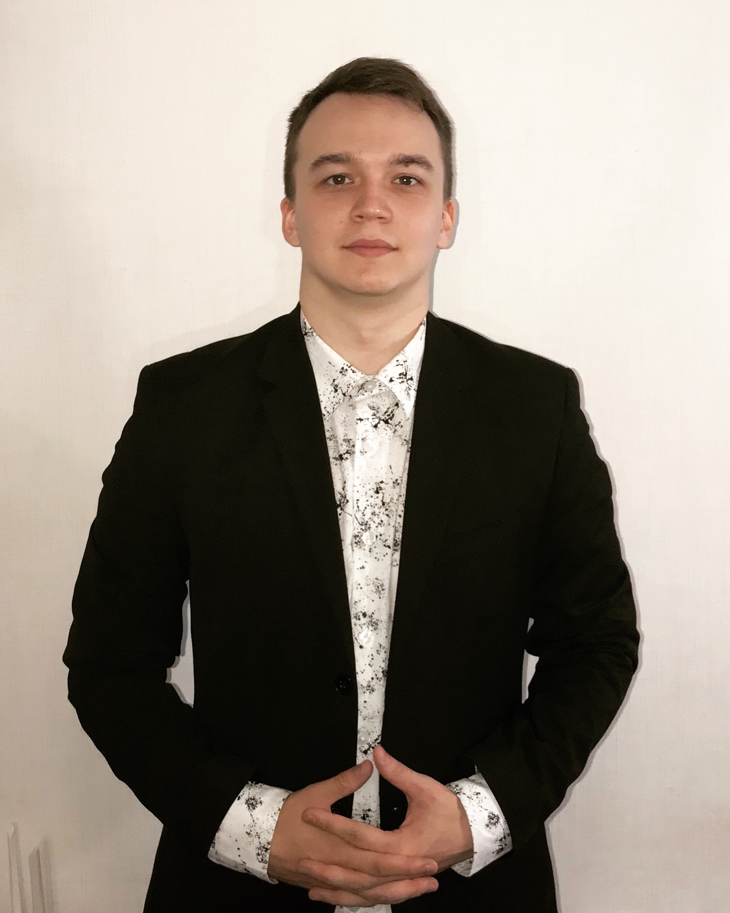

# Leonid Shchipkov 

Занимаюсь программированием, обучаюсь в университете 2 курс на факультете 
“Информационные системы и технологии” по заочной форме, прохожу курс 
iOS-разработчик в Нетологии. Имею опыт работы с GIT, CocoaPods, SwiftLint, 
SDWebImage, iOS SDK.
В IOS-разработке мне нравится безопасность, конфиденциальность, скорость, 
гибкость, возможность работы удаленно, поэтому принял решение развивать 
карьеру в этом направлении. Рассматриваю проекты в сфере улучшения 
качества жизни человека, развлечения, финансов, образования.

## Навыки:
* Применение объектно-ориентированного дизайна
* Создание адаптивного интерфейса приложения и работа с анимацией
* Инструменты:
  * Swift
  * Xcode
  * Git
  * CoreData
  * Cocoapods
  * GCD
  * SwiftLint
  * SwiftUI
  * UIKit

